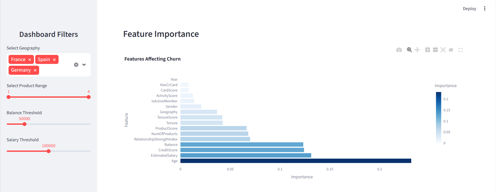
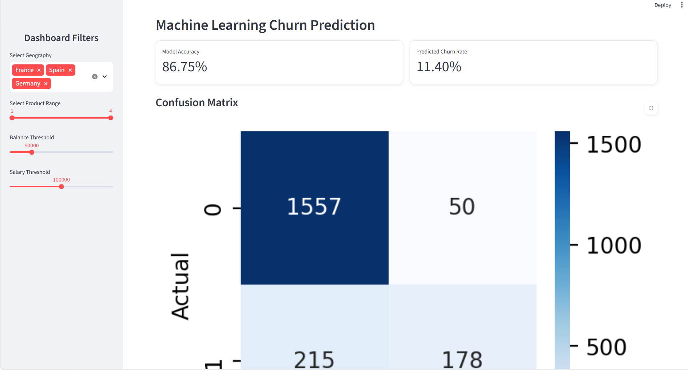

# 🏦 Customer Engagement & Product Utilization Analytics for Retention Strategy

## Live Dashboard

🔗 **Streamlit App: https://customer-engagement-retention-strategy-myur7eozgz2reb8appnntk9.streamlit.app/

🔗 **GitHub Repository: https://github.com/javvajidurgarani/Customer-Engagement-Retention-Strategy

---

Project Overview

This project analyzes customer retention in the banking sector using customer engagement, product utilization, and relationship-strength metrics.

Traditional churn analysis often focuses on demographic and financial indicators. This project demonstrates that customer engagement and product adoption are stronger indicators of long-term retention than balance or salary alone.

The solution was developed as part of an internship project focused on designing data-driven retention strategies for the banking industry.

---

 Problem Statement

Banks often have access to customer engagement and product usage data but lack:

* Quantitative insight into behaviors driving retention
* Understanding of product depth impact on churn
* Visibility into disengaged high-value customers
* Actionable retention strategies based on customer behavior

This project addresses these challenges through behavioral analytics and machine learning.

---

 Project Objectives

 Primary Objectives

* Evaluate the relationship between engagement and churn
* Measure retention impact of product count and product mix
* Identify disengaged yet high-value customers

 Secondary Objectives

* Support engagement-driven retention strategies
* Improve product bundling decisions
* Reduce silent churn among premium customers

---

Analytical Methodology

 1. Data Validation

* Dataset quality checks
* Missing value analysis
* Binary variable validation

 2. Customer Engagement Classification

Customers were classified into:

* Loyal Customers
* Cross-Sell Opportunities
* Silent Churners
* Weak Relationship Customers

 3. Product Utilization Analysis

* Product count vs churn
* Single-product vs multi-product retention
* Product depth analysis

 4. Financial Commitment Analysis

* Balance vs churn
* Salary vs balance relationship
* Premium customer risk detection

 5. Relationship Strength Assessment

Developed a custom:

**Relationship Strength Index (RSI)**

Based on:

* Customer activity
* Product usage
* Tenure
* Credit card ownership

---

 Machine Learning Model

 Algorithm

Random Forest Classifier

 Performance

* Accuracy: ~86%
* Confusion Matrix
* Classification Report
* Feature Importance Analysis

---
 Dashboard Features

 Customer Retention Overview

* Total customers
* Churn rate
* Active customer ratio
* Average balance
* Average product utilization

 Engagement Analytics

* Active vs inactive churn comparison
* Retention behavior analysis

Product Utilization Analytics

* Product count impact on churn
* Single vs multi-product comparison

 Customer Segmentation

* Loyal customers
* Silent churners
* Cross-sell opportunities
* Weak relationship customers

 High-Value Customer Detector

Identifies:

* High-balance customers
* High-salary customers
* Inactive premium customers

Machine Learning Insights

* Churn prediction
* Feature importance
* Model evaluation metrics

---
Dashboard Overview

Overview


 Churn Analysis


  Charts


  ML Model



## Technology Stack

* Python
* Pandas
* NumPy
* Streamlit
* Plotly
* Matplotlib
* Seaborn
* Scikit-Learn

---

## Run Locally

```bash
pip install -r requirements.txt
streamlit run streamlit_app.py
```


