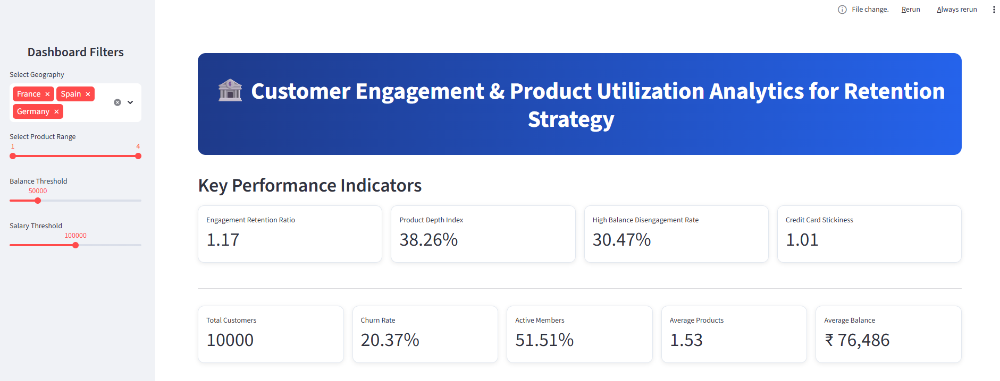
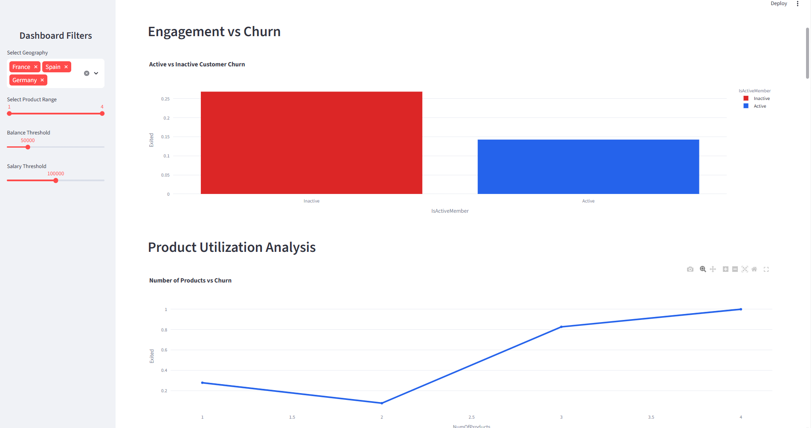
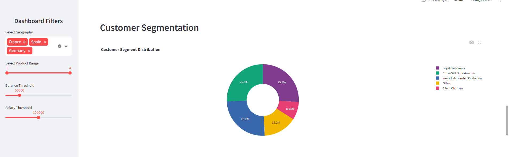
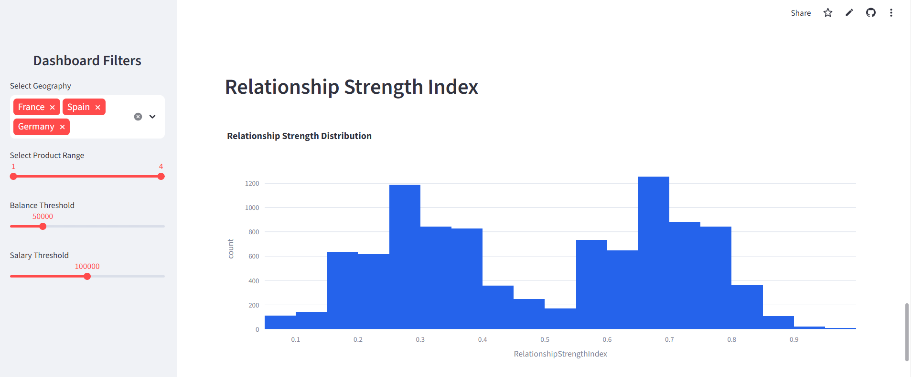

# 🏦 Customer Engagement & Product Utilization Analytics for Retention Strategy

## Live Dashboard

🔗 **Streamlit App: https://customer-engagement-retention-strategy-myur7eozgz2reb8appnntk9.streamlit.app/

🔗 **GitHub Repository: https://github.com/javvajidurgarani/Customer-Engagement-Retention-Strategy

---

# Project Overview

This project focuses on analyzing customer retention in the banking sector using customer engagement behavior and product utilization analytics.

Traditional retention strategies often rely heavily on financial indicators such as account balance and salary. However, customers may still churn due to low engagement, weak product adoption, and poor relationship strength with the bank.

The project evaluates how customer activity, product utilization, and relationship depth influence customer retention and loyalty. An interactive Streamlit dashboard was developed to visualize customer behavior, churn patterns, customer segmentation, and retention insights.

---

# Problem Statement

Banks often possess customer engagement and product usage data but lack:

* Quantitative insight into behaviors driving retention
* Understanding of product utilization impact on churn
* Visibility into disengaged high-value customers
* Behavioral analytics-based retention strategies

As a result, retention campaigns are frequently generic and ineffective.

This project addresses these challenges through engagement analytics and relationship-strength evaluation.

---

# Project Objectives

## Primary Objectives

* Evaluate the relationship between engagement and churn
* Measure retention impact of product utilization
* Identify disengaged high-value customers

## Secondary Objectives

* Support engagement-driven retention strategies
* Improve product bundling decisions
* Reduce silent churn among premium customers

---

# Dataset Description

The dataset contains banking customer information including demographics, financial status, engagement behavior, and churn indicators.

| Feature         | Description                |
| --------------- | -------------------------- |
| CreditScore     | Customer creditworthiness  |
| Geography       | Customer country           |
| Gender          | Customer gender            |
| Age             | Customer age               |
| Tenure          | Years with bank            |
| Balance         | Account balance            |
| NumOfProducts   | Number of banking products |
| HasCrCard       | Credit card ownership      |
| IsActiveMember  | Activity status            |
| EstimatedSalary | Estimated annual salary    |
| Exited          | Customer churn indicator   |

---

# Project Methodology

## 1. Data Ingestion & Validation

* Loaded dataset using Pandas
* Verified engagement and product fields
* Checked binary variable consistency
* Validated churn labels

## 2. Customer Engagement Classification

Customers were segmented into:

* Loyal Customers
* Silent Churners
* Cross-Sell Opportunities
* Weak Relationship Customers

## 3. Product Utilization Analysis

The analysis evaluated:

* Churn rate by number of products
* Single-product vs multi-product retention
* Product depth impact on loyalty

## 4. Financial Commitment Analysis

The project analyzed:

* Balance vs activity relationship
* Salary vs balance comparison
* High-value disengaged customer detection

## 5. Relationship Strength Assessment

A custom Relationship Strength Index (RSI) was developed using:

* Customer activity
* Product utilization
* Tenure
* Credit card ownership

---

# Dashboard Features

## KPI Monitoring

* Engagement Retention Ratio
* Product Depth Index
* High-Balance Disengagement Rate
* Credit Card Stickiness Score
* Relationship Strength Index

## Interactive Analytics

* Engagement vs churn analysis
* Product utilization analysis
* Geography-wise churn analysis
* Customer segmentation visualization
* Relationship strength distribution
* Premium customer risk analysis

## User Filters

* Geography filters
* Product range sliders
* Balance threshold filters
* Salary threshold filters

---

# Key Insights

✅ Active customers demonstrate significantly lower churn rates.

✅ Multi-product customers show stronger retention behavior.

✅ High-balance inactive customers represent silent churn risk.

✅ Product utilization is a stronger retention indicator than financial value alone.

✅ Relationship strength strongly influences customer loyalty.

---

# Business Recommendations

## Retention Strategy

* Increase engagement campaigns for inactive customers
* Monitor customer activity levels regularly
* Improve customer relationship management

## Product Strategy

* Promote multi-product adoption
* Introduce cross-selling campaigns
* Encourage bundled banking services

## Premium Customer Strategy

* Track inactive high-value customers
* Launch personalized loyalty programs
* Implement proactive retention initiatives

---

# Dashboard Screenshots

## Dashboard Overview



## Engagement vs Churn Analysis and Product Utilization analysis



## Customer Segmentation



## Relationship Strength Analysis




---

# Technology Stack

* Python
* Pandas
* NumPy
* Plotly
* Streamlit
* Matplotlib
* Seaborn

---

# Run Locally

```bash
pip install -r requirements.txt
streamlit run streamlit_app.py
```

---

# Future Enhancements

* Real-time customer monitoring
* Advanced behavioral analytics
* Automated retention recommendation systems
* Customer lifetime value analysis
* AI-driven engagement strategies

---

# Conclusion

This project demonstrates that customer engagement and product utilization are critical factors influencing customer retention in the banking sector.

The developed analytics framework and Streamlit dashboard provide actionable insights for engagement-driven retention strategies, customer relationship management, and product optimization.

The study highlights the importance of behavioral analytics in improving customer loyalty and reducing churn risk.

---

# Author

Internship Project

Customer Engagement & Product Utilization Analytics for Retention Strategy

Built using Python and Streamlit.

